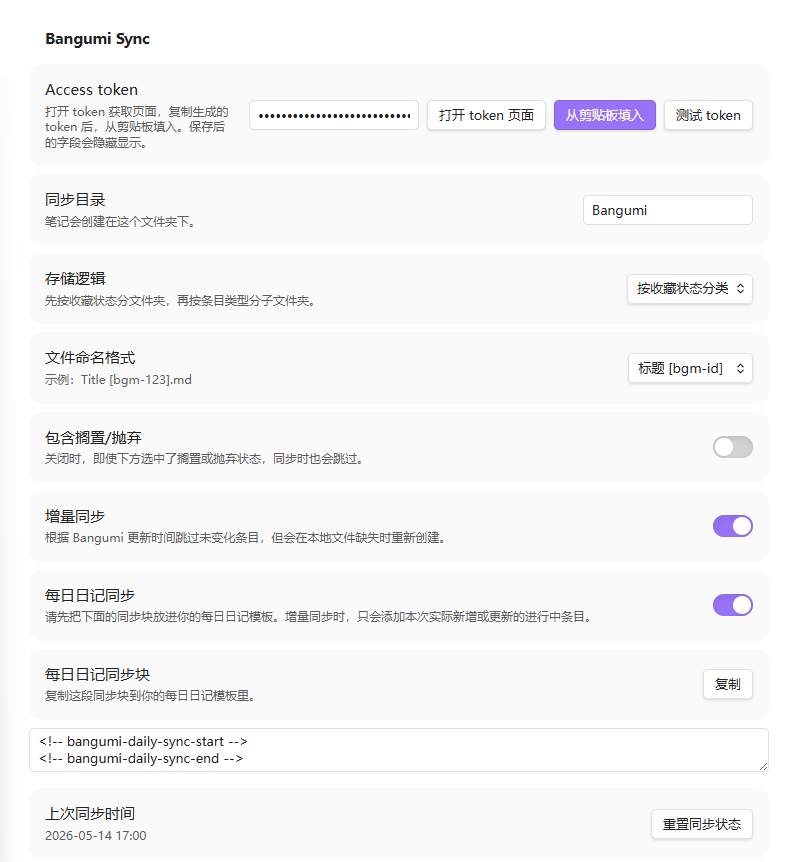
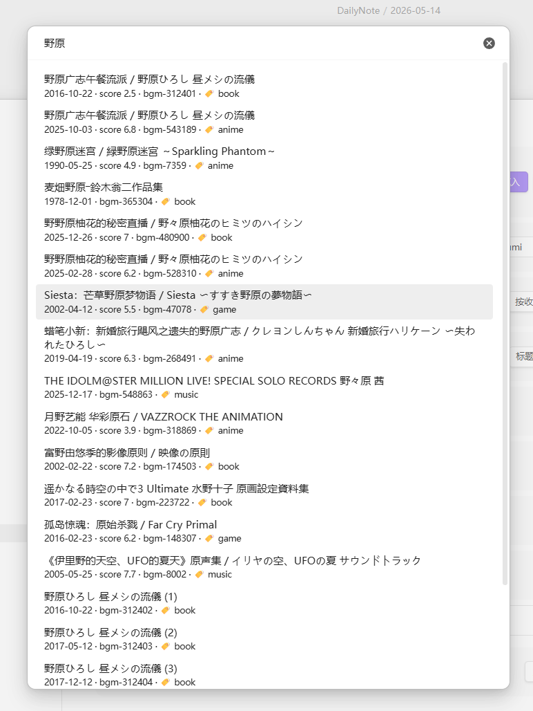
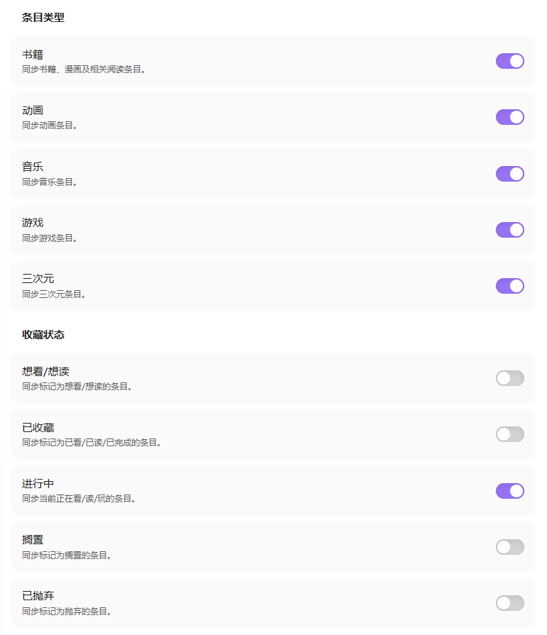
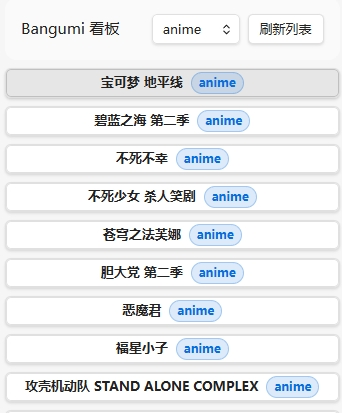
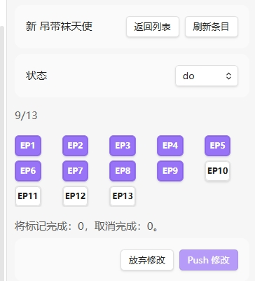
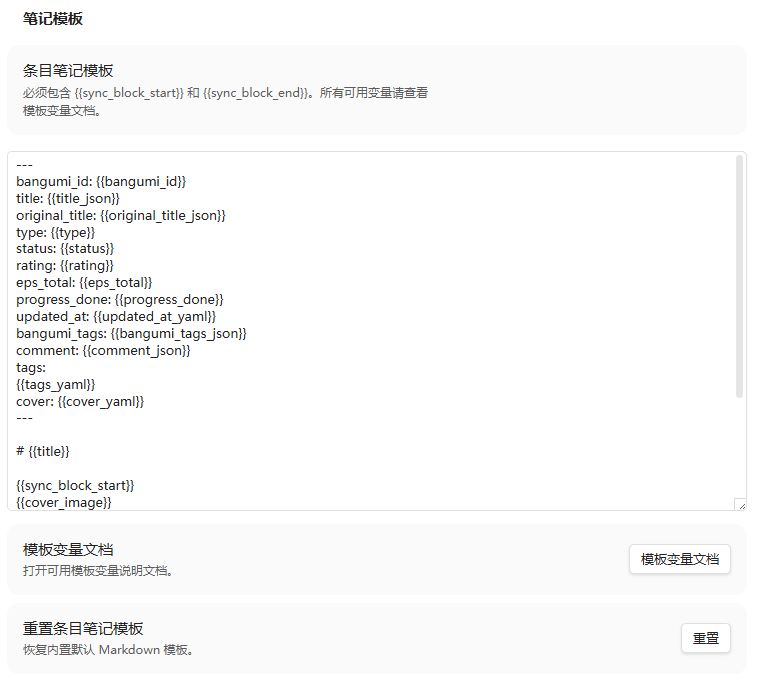
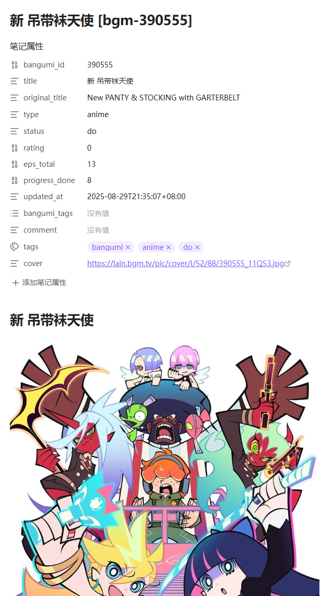
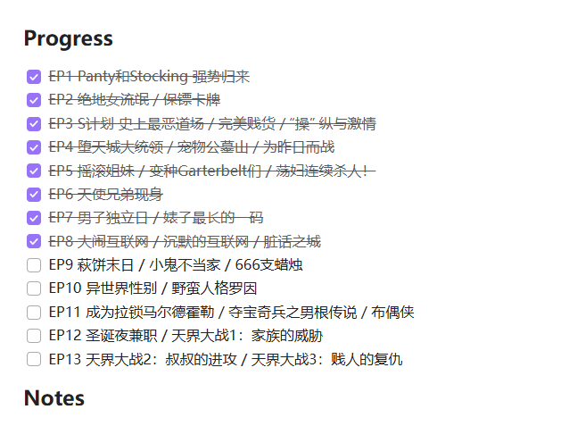
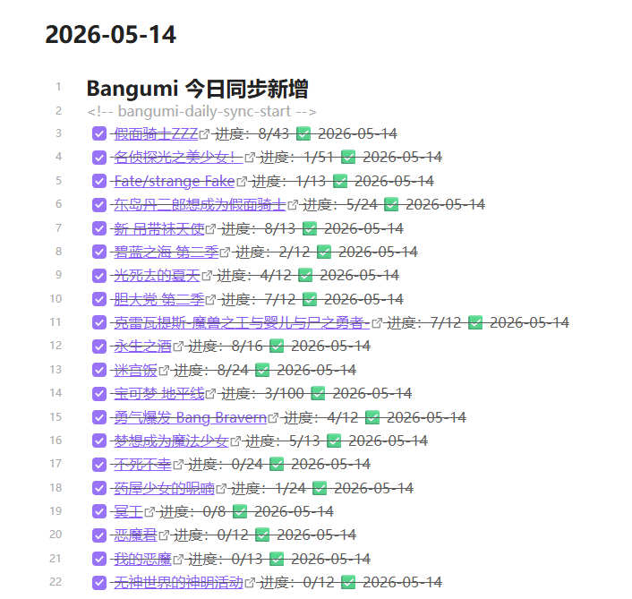

# Bangumi Sync

[English](README-en.md) | 中文文档

## 一句话介绍

Bangumi Sync 是一个 Obsidian 插件，用于把 Bangumi 收藏同步到本地笔记。它支持多条目类型、收藏状态筛选、章节进度、增量同步、每日笔记同步块、数据写回和用户可编辑模板。

## 功能特性

- 同步 Bangumi 书籍、动画、音乐、游戏和三次元条目。
- 按收藏状态筛选同步：想看、已看、进行中、搁置、抛弃。
- 支持增量同步：在本地条目笔记被误删时自动补回。
- 自定义同步：同步评分、标签、评论、封面、章节 checklist 和其他可选字段，支持自定义条目笔记模板和 frontmatter 字段，具体见变量文档。
- 笔记分区同步：使用同步块方法，文件内可进行其他编写行为。
- 日记同步：可选把本次新增或更新的进行中条目写入日记同步块。
- 每日放送：可选生成独立的每日放送笔记，包含全列表和你的想看/进行中动画收藏列表。
- 单条目同步：支持单独搜索并同步一个条目，可输入 Bangumi 链接、ID、中文名、原名或标题关键词。
- 追番看板：提供进行中看板，集中查看 `status: do` 条目，并用格子界面安全 Push 章节进度。
- 写回bangumi：支持显式 Push 当前条目笔记的章节进度和状态到 Bangumi，并在写回后重新校验远端结果。
- 错误审查：同步失败时生成 `Bangumi Sync Report.md`，方便排查问题。

## 界面展示
### 基础功能


### 单收藏同步


### 按分类同步


### Bangumi看板


### 笔记模板


### 条目页面
 


### 日记预览

## 安装

### Obsidian 社区插件

1. 打开 Obsidian 设置。
2. 进入 `第三方插件`，确认已关闭安全模式。
3. 点击 `浏览`，搜索 `bangumi`。
4. 安装并启用插件。

### 手动安装

1. 下载发布包中的 `manifest.json` 和 `main.js`。
2. 在你的 Obsidian 库中创建目录：`.obsidian/plugins/bangumi-note/`。
3. 将 `manifest.json` 和 `main.js` 放入该目录。
4. 重启 Obsidian 或刷新插件列表。
5. 在设置 → 第三方插件中启用 `bangumi`。

### BRAT

如果你使用 [BRAT](https://github.com/TfTHacker/obsidian42-brat) 安装 beta/开发版插件：

1. 先在 Obsidian 中安装并启用 BRAT。
2. 打开命令面板，运行 `BRAT: Add a beta plugin for testing`。
3. 输入本仓库地址，例如 `kuanphough/obsidian-bangumi`，或完整 GitHub URL。
4. 等待 BRAT 下载插件后，在第三方插件列表中启用 `bangumi`。

BRAT 适合测试开发版。正式发布后，普通用户更建议使用 Obsidian 社区插件或 GitHub release 附件安装。

## 快速开始

1. 打开插件设置，点击 `打开 token 页面`。
2. 登录 Bangumi，创建 access token 并复制。
3. 回到 Obsidian，点击 `从剪贴板填入`，或手动粘贴到 `Access token`。
4. 点击 `测试 token` 确认配置有效。
5. 选择同步目录、存储逻辑、文件命名、条目类型和收藏状态。
6. 点击左侧栏图标，或运行命令 `Bangumi Sync: Sync now`。
7. 如需单独补一个条目，运行命令 `Bangumi Sync: Sync one subject`，或在设置页点击 `Sync one subject`。

插件会自动使用 token 所属的 Bangumi 账号，不需要填写用户名。`User-Agent` 会按插件版本自动生成。

## Access Token

获取 token 的页面：<https://next.bgm.tv/demo/access-token/create>

请妥善保管 token。它会授权插件读取你的 Bangumi 账号数据。设置页里的 token 输入框会以密码字段显示。

## 设置说明

| 设置 | 说明 |
| --- | --- |
| `Access token` | Bangumi access token。可以手动粘贴，也可以从剪贴板填入。 |
| `Sync directory` | 同步笔记的根目录，默认 `Bangumi`。 |
| `Storage layout` | 控制是否按条目类型或收藏状态分文件夹。 |
| `File name format` | 控制条目笔记文件名，默认 `Title [bgm-id].md`。 |
| `Include on hold/dropped` | 是否同步搁置和抛弃条目。 |
| `Incremental sync` | 根据 Bangumi 更新时间跳过未变化条目，并补回本地缺失文件。 |
| `Daily note sync` | 将本次新增或更新的进行中条目写入今天的 Daily Note 同步块。 |
| `Enable On Air note` | 同步后生成 `Bangumi/On Air.md`，按星期展示全站放送和你的想看/进行中动画收藏。 |
| `Enable write-back to Bangumi` | 允许手动 Push 当前条目笔记的章节 checklist 和收藏状态到 Bangumi。默认关闭，每次 Push 前都会要求确认。 |
| `Subject note template` | 自定义条目笔记 Markdown 模板。 |

## 单独同步条目

运行命令 `Bangumi Sync: Sync one subject`，或在设置页点击 `Sync one subject`，会直接打开搜索候选框。你可以输入：

- Bangumi 条目链接，例如 `https://bgm.tv/subject/543189`
- Bangumi subject ID，例如 `543189`
- 中文名、原名或标题关键词

如果输入的是链接或 ID，候选框会显示一条直接同步选项。如果输入的是关键词，插件会搜索书籍、动画、音乐、游戏和三次元条目，并在候选结果里显示年份、评分、`bgm-id` 和条目类型标签。

如果条目已经在你的 Bangumi 收藏里，插件会读取真实收藏状态、评分、标签和评论。如果条目不在收藏里，插件会让你选择一个本地状态，用于生成笔记和分类；这个状态只保存在本地笔记中，不会写回 Bangumi。

## Bangumi 看板

运行命令 `Bangumi Sync: Open Bangumi board`，或点击侧边栏看板图标，可以打开进行中看板。

看板只扫描同步目录内的 Bangumi 笔记，并只显示 frontmatter 中 `status: do` 的条目。类型筛选默认是 `anime`，也可以切换到全部类型、书籍、音乐、游戏或三次元。列表只显示条目标题和类型标签；打开列表本身不会逐条拉取章节，只有点击某个条目时才会加载该条目的章节进度并显示格子。

在格子界面中，点击章节只会修改本地预览。点击 `Push 修改` 并确认后，插件才会写回 Bangumi，并重新拉取远端进度校验结果。看板里也可以修改条目收藏状态；每次修改状态都会弹出评论输入框，确认后将新状态和评论一起写入 Bangumi。状态修改成功后，本地笔记的 `status` 和 `comment` 会更新；如果使用分类存储，笔记也会移动到对应状态目录。

## 写回 Bangumi

写回功能默认关闭。开启 `Enable write-back to Bangumi` 后，可以在一条 Bangumi 条目笔记中运行命令 `Bangumi Sync: Push current note to Bangumi`。

第一版写回范围很窄：

- 只处理当前打开的条目笔记，不批量写回。
- `status` 可写回 `wish`、`do`、`collect`、`on_hold` 和 `dropped`。
- 章节 checklist 勾选变化只在 `do` / `collect` 条目中写回。
- 不写回评分、标签、评论、模板外正文或 Daily Note 内容。
- 写回后会重新读取 Bangumi 远端数据，确认章节进度和状态已经生效；如果远端没有确认，插件会提示失败，而不会假装成功。
- 如果存储逻辑不是“不分类”，状态写回成功后会按最终远端状态自动移动当前笔记。

旧笔记如果没有 `<!-- bgm-ep:... -->` 章节标记，需要先重新同步一次再 Push。

## 每日放送

开启 `Enable On Air note` 后，每次 `Sync now` 完成都会更新独立笔记 `Bangumi/On Air.md`。也可以运行命令 `Bangumi Sync: Update On Air note` 手动刷新。

第一版使用 Bangumi legacy `/calendar` 一周动画放送表。笔记里会生成两个分区：`My Collections` 只显示你的 `wish` 和 `do` 动画收藏；`All On Air` 显示 Bangumi 日历里的完整放送列表。两个分区都按星期一到星期日分组。

收藏分区每条是 todo 格式，不再逐条拉取章节进度，刷新速度更快：

```markdown
- [ ] [[本地条目笔记|标题]] · status: do
```

如果本地已有对应条目笔记，标题会链接到本地笔记；否则链接到 Bangumi 条目页。因为 `/calendar` 是动画放送表，本功能暂不支持书籍、音乐、游戏和三次元。

## 同步行为

- 重复同步时会更新 frontmatter 和 `<!-- bangumi-sync-start -->` 到 `<!-- bangumi-sync-end -->` 之间的同步块。
- 同步块之外的内容会保留，包括用于长期记录的 `## Notes`。
- 全量同步也会先比较生成内容；如果没有变化，不会刷新本地文件。
- 章节进度拉取失败不会阻止条目笔记生成，报告中会显示“没拉到进度内容”。
- 某个条目失败不会中断整次同步，结束后会汇总问题并生成报告。
- 单独同步条目时，插件会先检查该条目是否已收藏；对于未收藏条目，选择本地状态前可能会有短暂等待。

## 笔记模板

`Subject note template` 必须包含：

```markdown
{{sync_block_start}}
{{sync_block_end}}
```

默认 frontmatter 只保留基础检索字段和 `progress_done`。如果需要 `progress_total`、`progress_percent`、下一集、最后完成集等字段，可以在自定义模板里手动加回。

完整变量说明见 [Subject Note Template Variables](docs/template-variables.md)。设置页按钮也会在同步目录下创建并打开本地 `Template Variables.md`。

## 每日日记同步

开启 `Daily note sync` 后，请先把下面的标记放入你的 Daily Note 模板：

```markdown
<!-- bangumi-daily-sync-start -->
<!-- bangumi-daily-sync-end -->
```

同步后插件只会写入这两个标记之间，例如：

```markdown
- [x] [名侦探光之美少女！](https://bgm.tv/subject/611077) 进度：1/24 ✅ 2026-05-14
```

增量同步时，只会添加本次实际新增或更新的进行中条目。

## 当前限制

- 暂不支持 OAuth 登录；目前使用手动 access token。
- Bangumi v0 章节收藏接口不返回用户单集评论，因此无法同步单集评论。
- 写回 Bangumi 仍是实验性功能，只支持当前条目笔记的状态和 `do` / `collect` 条目的章节 checklist。
- 插件目前以桌面端为主。移动端兼容性可能不佳，尤其是剪贴板、打开 token 页面、Daily Note 路径识别和大文本框设置页布局，请谨慎使用。

## 反馈与支持

如果遇到问题，请在 issue 中附上：

- Obsidian 版本和插件版本
- 同步时的收藏类型和收藏状态设置
- `Bangumi Sync Report.md` 中的相关错误
- 可复现步骤


后续计划见 [Roadmap](docs/roadmap.md)。

## 致谢

这个插件参考并受益于许多前辈项目和文档：

- [Obsidian 官方插件文档](https://docs.obsidian.md/Plugins/Getting+started/Build+a+plugin)：插件结构、设置页和构建流程的基础参考。
- [obsidian-sample-plugin](https://github.com/obsidianmd/obsidian-sample-plugin)：插件脚手架、版本更新和发布流程参考。
- [Bangumi API](https://github.com/bangumi/api)：Bangumi 数据同步能力的基础。
- [obsidian-weread-plugin](https://github.com/zhaohongxuan/obsidian-weread-plugin)：同步型阅读/收藏插件的设计参考。
- [yearly-glance](https://github.com/Moyf/yearly-glance)：README 结构和正式发布文档的参考。

## License

本项目基于 MIT License 开源。详见 [LICENSE](LICENSE) 文件。
